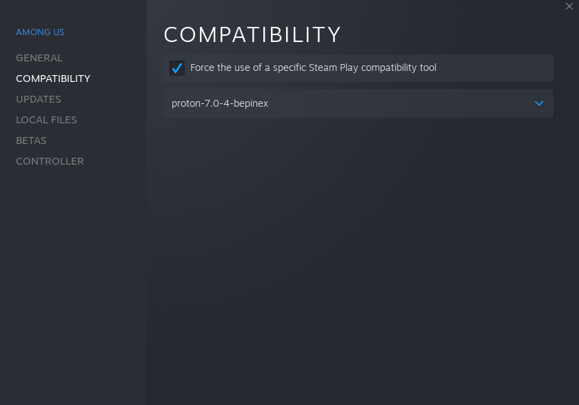

# MeindosMod (or other mods) on Linux 

A guide for running Among Us (Steam Edition) with mods on linux. 

## IMPORTANT
To run any mod on any version using BepInEx, you should add `WINEDLLOVERRIDES="winhttp=n,b"` to the custom launch command in Steam. 
Otherwise it WONT work at all. 

## Note about Among Us 2022.10.25 

Since the release of 2022.10.25, BepInEx, the framework used for injecting code and modifying the game, switched over to CoreCLR instead of mono. 
Because of this change, Among Us wont launch with normal proton over Steam. 
It wont launch because Proton, the compatibility tool used by steam, hasn't implemented the fix for this issue, which HAS been fixed in newer wine versions. 

## 2022.10.25 and up

To run MeindosMod  on this version you need a custom proton version, until the official one is patched. 
You can get this custom proton from [here](https://mini.duikbo.at/proton-7.0-4-bepinex.tar.xz) precompiled (Thanks Miniduikboot), or compile his [branch](https://github.com/miniduikboot/wine/tree/fix/bepinex_coreclr_i386) by yourself. 
For a bit more information from miniduikboot himself, please check this [issue](https://github.com/NuclearPowered/Reactor/issues/66) (Again thanks a lot Miniduikboot).  
Once you have downloaded the custom version you need to install it. 
1. To install the custom proton version, first create a ``~/.steam/root/compatibilitytools.d`` directory if it doesnt exist.  
2. Then extract the archive to that direcory ``tar -xf proton-7.0-4-bepinex.tar.xz -C ~/.steam/root/compatibilitytools.d/``  
3. Restart steam  
4. Enable the custom proton version in game settings 

To enable a custom proton version follow these steps 
1. Right click any game in Steam and click Properties. 
2. At the bottom of the `Compatibility` tab, Check `Force the use of a specific Steam Play compatibility tool`, then select proton-7.0-4-bepinex. 
It should now look something like this 

### After installing custom proton

You should download the latest [BepInEx bleeding edge](https://builds.bepinex.dev/projects/bepinex_be).  
Then download the appropriate [Reactor](https://github.com/NuclearPowered/Reactor/releases/tag/2.0.0) mod and [MeindosMod](https://github.com/Meindo/MeindosMod).  
Once those files have been acquired, you need to extract the BepInEx file to the root of the game directory. (You can find by going into steam and clicking browse local files).  
At last move the 2 dll's from the mods into the `BepInEx/plugins` folder  

## 2022.8.23 and Under

Generally the specific mod has instructions on its readme or release notes, please refer to that for now (Since this section is a WIP). 

## Credits

- [MeindoMC](https://github.com/meindo), myself for this guide
- [Miniduikboot](https://github.com/miniduikboot) for the fixed proton and assisting on the issue.
- [The proton team](https://github.com/ValveSoftware/Proton/graphs/contributors), for proton itself. Indirectly also the [wine team](https://github.com/ValveSoftware/wine/graphs/contributors).
- The [BepInEx team]()