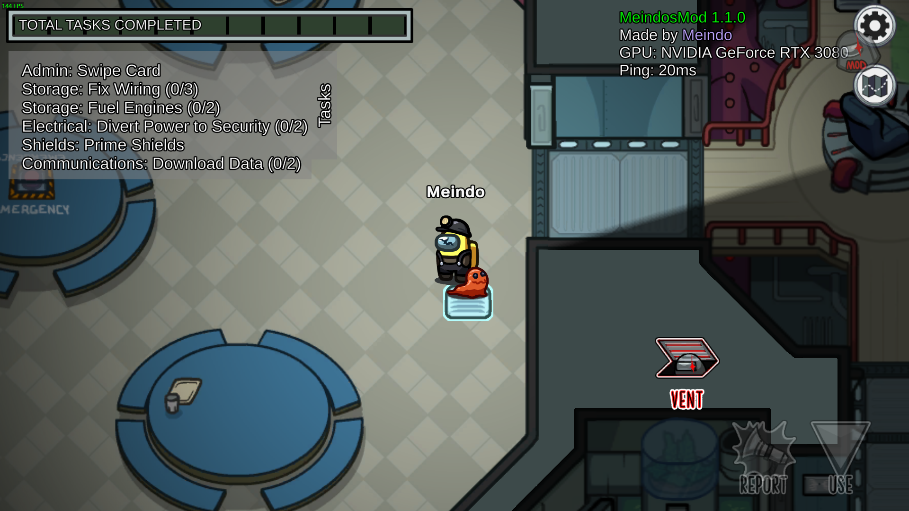

# MeindosMod

Custom Among Us mod with some patches and "hacks" 

## Features
- Fullbright (Or Lighting mod) - Brighten up your game without being impostor! 
- Engineer (Always Vent mod) - Allows you to vent without being actual engineer or impostor 
- Imposter Enhanced - 

## Config
You can change the settings in the BepInEx/config/MeindosMod.cfg file

## Useful Notes
- Requires [Reactor](https://github.com/NuclearPowered/Reactor) installed
- Runs on [BepInEx](https://github.com/BepInEx/BepInEx)
- When you are actual engineer in game AND the engineer mode is enabled, you can only vent using the impostor vent button. Look at screenshot below to see how that works.
- The entire mod runs client side, other people dont need to have it installed.

## Screen Shot:
